# ORCID Research Platform - Entity-Relationship Diagram

This file contains the Entity-Relationship diagram for the ORCID Research Platform database schema.

## How to View the Diagram

You can view this diagram by:
1. Using any Mermaid-compatible viewer (GitHub, GitLab, VS Code with Mermaid extension)
2. Online at [Mermaid Live Editor](https://mermaid.live/)
3. Copy the code below and paste it into any Mermaid renderer

## Entity-Relationship Diagram

```mermaid
erDiagram
    User {
        uuid id PK
        string username
        string orcid_id UK
        text orcid_access_token
        text orcid_refresh_token
        datetime orcid_token_expires_at
        string display_name
        text biography
        url profile_picture_url
        url website_url
        boolean profile_public
        boolean show_publications
        boolean show_affiliations
        boolean show_metrics
        datetime created_at
        datetime updated_at
        datetime last_orcid_sync
    }

    Institution {
        uuid id PK
        string name
        string short_name
        string country
        string city
        string ror_id
        string grid_id
        string wikidata_id
        url website_url
        url logo_url
        integer established_year
        string institution_type
        datetime created_at
        datetime updated_at
    }

    Affiliation {
        uuid id PK
        uuid user_id FK
        uuid institution_id FK
        string affiliation_type
        string title
        string department
        date start_date
        date end_date
        boolean is_current
        string orcid_put_code
        string visibility
        datetime created_at
        datetime updated_at
    }

    Work {
        uuid id PK
        text title
        string work_type
        string journal_title
        date publication_date
        integer publication_year
        string doi UK
        string pmid
        string isbn
        string issn
        string arxiv_id
        text abstract
        json keywords
        string language
        url url
        url pdf_url
        string orcid_put_code
        string visibility
        integer citation_count
        datetime last_citation_update
        datetime created_at
        datetime updated_at
    }

    WorkAuthor {
        uuid id PK
        uuid work_id FK
        uuid user_id FK
        string name
        string orcid_id
        string email
        string affiliation_name
        integer author_order
        boolean is_corresponding
        json contribution_roles
        datetime created_at
    }

    Funding {
        uuid id PK
        uuid user_id FK
        string title
        string funding_type
        string organization_name
        string organization_country
        string grant_number
        decimal amount
        string currency
        date start_date
        date end_date
        text description
        url url
        string orcid_put_code
        string visibility
        datetime created_at
        datetime updated_at
    }

    ResearchArea {
        uuid id PK
        string name UK
        text description
        uuid parent_id FK
        string subject_scheme
        url subject_scheme_uri
        datetime created_at
    }

    UserResearchArea {
        uuid id PK
        uuid user_id FK
        uuid research_area_id FK
        boolean is_primary
        datetime created_at
    }

    Citation {
        uuid id PK
        uuid citing_work_id FK
        uuid cited_work_id FK
        text citation_context
        string page_number
        string source
        datetime discovered_at
    }

    UserMetrics {
        uuid id PK
        uuid user_id FK
        integer total_publications
        integer total_citations
        integer h_index
        integer i10_index
        integer years_active
        integer first_publication_year
        integer last_publication_year
        float avg_citations_per_paper
        integer max_citations_single_paper
        integer total_collaborators
        integer total_institutions
        integer total_countries
        datetime last_calculated
        string calculation_version
    }

    CollaborationNetwork {
        uuid id PK
        uuid user1_id FK
        uuid user2_id FK
        integer total_collaborations
        date first_collaboration_date
        date last_collaboration_date
        datetime created_at
        datetime updated_at
    }

    CitationTimeSeries {
        uuid id PK
        uuid user_id FK
        integer year
        integer citations_count
        datetime created_at
        datetime updated_at
    }

    APIUsageLog {
        uuid id PK
        uuid user_id FK
        inet ip_address
        string endpoint
        string method
        text user_agent
        integer status_code
        integer response_time_ms
        string rate_limit_key
        integer requests_in_window
        datetime timestamp
    }

    %% Relationships
    User ||--o{ Affiliation : "has affiliations"
    Institution ||--o{ Affiliation : "employs/educates"
    
    User ||--o{ WorkAuthor : "authors works"
    Work ||--o{ WorkAuthor : "has authors"
    
    User ||--o{ Funding : "receives funding"
    
    User ||--o{ UserResearchArea : "specializes in"
    ResearchArea ||--o{ UserResearchArea : "studied by"
    ResearchArea ||--o{ ResearchArea : "hierarchical"
    
    Work ||--o{ Citation : "cites other works"
    Work ||--o{ Citation : "cited by works"
    
    User ||--|| UserMetrics : "has metrics"
    
    User ||--o{ CollaborationNetwork : "collaborates with user1"
    User ||--o{ CollaborationNetwork : "collaborates with user2"
    
    User ||--o{ CitationTimeSeries : "has yearly citations"
    
    User ||--o{ APIUsageLog : "makes API calls"
```

## Relationship Details

### Primary Relationships

1. **User ↔ Affiliation ↔ Institution**
   - Users have affiliations with institutions
   - Supports multiple types: employment, education, distinctions, etc.
   - Temporal tracking with start/end dates

2. **User ↔ WorkAuthor ↔ Work**
   - Many-to-many relationship between users and works
   - Includes authorship metadata (order, corresponding author, contributions)
   - Supports external authors (non-registered users)

3. **User ↔ Funding**
   - One-to-many relationship for research funding
   - Tracks grant details, amounts, and funding organizations

4. **Work ↔ Citation ↔ Work**
   - Self-referencing relationship for citation tracking
   - Enables impact analysis and citation networks

5. **User ↔ CollaborationNetwork ↔ User**
   - Self-referencing many-to-many for collaboration tracking
   - Measures collaboration strength and temporal patterns

### Supporting Relationships

- **User ↔ UserResearchArea ↔ ResearchArea**: Research specializations
- **User ↔ UserMetrics**: Cached performance metrics (1:1)
- **User ↔ APIUsageLog**: System usage tracking
- **ResearchArea ↔ ResearchArea**: Hierarchical taxonomy

## Key Design Features

- **UUID Primary Keys**: Enhanced security and scalability
- **ORCID Integration**: Built around ORCID identifiers
- **Temporal Tracking**: Created/updated timestamps throughout
- **Privacy Controls**: Visibility settings for user data
- **External Identifiers**: Support for DOI, ROR, GRID, etc.
- **Flexible Metadata**: JSON fields for extensible data
- **Performance Indexes**: Strategic indexing for common queries 